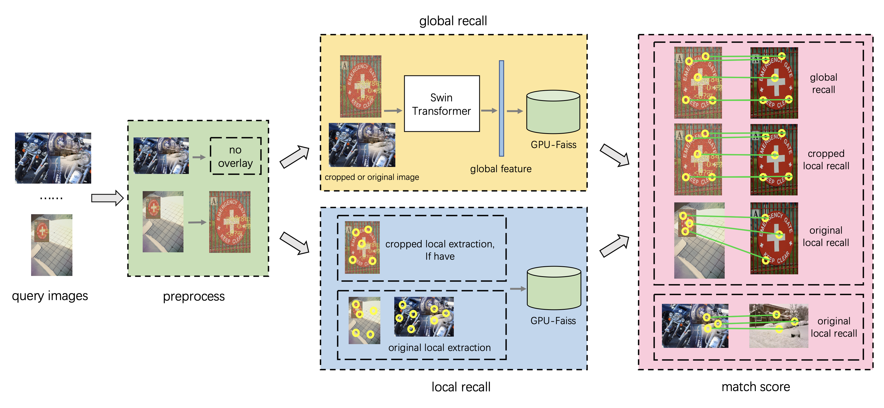

# Facebook AI Image Similarity Challenge: Matching Track —— Team: imgFp

This is the source code of our 3rd place solution to matching track of Image Similarity Challenge (ISC) 2021 organized by Facebook AI. This repo will tell you how to get our result step by step.

## Method Overview

For the Matching Track task, we use a global and local dual retrieval method. The global recall model is EsViT, the same as task Descriptor Track. The local recall used SIFT point features. As shown in the figure, our pipeline is divided into four modules. When using an image for query, it is first put into the preprocessing module for overlay detection. Then the global and local features are extracted and retrieved in parallel. There are three recall branches: global recall, original local recall and cropped local recall. The last module will compute the matching score of three branches and merge them into the final result. 


## Installation

Please install python 3.7, Pytorch 1.8 (or higher version) and some packages according to [requirements.txt](requirements.txt).

gcc version 7.3.1

We run on a 8GPUs (Tesla V100-SXM2-32GB, 32510.5MB), 48CPUs and 300G Memory machine.

## Get Result Demo
Now we will describe how to get our result, we use a query image `Q24789.jpg` as input for demo.
#### step1: query images preprocess 
We train a yolov5 to detect the crop augment in query images.
The detils are in README.md of `Team: AITechnology` in task Descriptor Track.
Due to different parameters, we need to preprocess the local recall and global recall respectively.
```
python preprocessing.py $origin_image_path $save_image_result_path

e.g.
______
cd preprocess
python preprocessing_global.py ../data/queryimages/ ../data/queryimages_crop_global/
python preprocessing_local.py ../data/queryimages/ ../data/queryimages_crop_local/
```
*note: If `Arial.ttf` download fails, please copy the local `yolov5/Arial.ttf` to the specified directory following the command line prompt. `cp yolov5/Arial.ttf /root/.config/Ultralytics/Arial.ttf`


#### step2: get original image's local feature
First export the path.
```
cd local_fea/feature_extract
export LD_LIBRARY_PATH=./extLib/ 
```
Run the executable program `localfea_extract_sift` to get the SIFT local point feature, and out to a txt file.
```
Usage: ./localfea_extract_sift <imgid> <imgpath> <outfile>

e.g.
./localfea_extract_sift Q24789 ../../data/queryimages/Q24789.jpg ../feature_out/Q24789.txt
```
Or you can extract all query images by a list.
```
python multi_extract_sift.py ../../data/querylist_demo.txt ../../data/queryimages/ ../feature_out/
```

For example, two point features in a image result txt file are:
```
Q24789_0_3.1348_65.589_1.76567_-1.09404||0,0,0,0,0,0,0,0,0,0,0,0,0,0,0,0,16,13,0,0,0,0,0,0,16,28,7,5,0,0,0,0,0,0,0,0,20,12,0,0,23,5,0,0,29,29,7,12,56,29,5,0,0,11,7,20,38,45,10,0,0,0,0,14,0,0,0,0,39,56,36,8,39,14,0,0,46,56,21,24,56,22,0,0,5,8,8,39,38,11,0,0,0,0,19,47,0,0,0,0,8,56,56,7,37,0,0,0,10,52,56,56,52,0,0,0,0,0,35,56,11,0,0,0,0,0,54,45
Q24789_1_8.26344_431.038_1.75921_1.22328||42,27,0,4,11,12,9,14,49,28,0,6,17,25,18,14,45,37,4,0,12,45,8,9,8,17,9,0,27,50,6,0,41,24,0,0,10,14,19,20,50,34,0,6,20,22,17,21,36,22,4,4,43,50,15,12,26,32,8,0,17,50,17,6,28,12,0,0,0,21,31,21,50,14,0,0,17,31,23,38,19,10,9,17,50,50,14,15,17,23,13,10,19,45,26,8,11,11,0,0,0,6,6,0,28,13,0,0,8,20,12,15,11,9,0,0,24,47,12,9,18,38,22,6,13,28,10,8
...
```

#### step3: retrieval use original image local feature
We use the GPU Faiss to retrieval, because there are about 600 million SIFT point features in reference images. They need about 165G GPU Memory for Float16 compute. 

Firstly, you need extract all local features of reference images by `multi_extract_sift.py` and store them in uint8 type to save space.  (ref_sift_fea_300.pkl (68G) and ref_sift_name_300.pkl (25G))

Then get original image local recall result:
```
cd local_fea/faiss_search
python db_search.py ../feature_out/ ../faiss_out/local_pair_result.txt
```
For example, the result txt file `../faiss_out/local_pair_result.txt`:
```
Q24789.jpg,R540735.jpg
```

#### step4: get crop image's local feature (only for part images which have crop result)
Same as step2, but only use the croped image in `../../preprocess/local_crop_list.txt`.
```
cd local_fea/feature_extract
python multi_extract_sift.py ../../preprocess/local_crop_list.txt ../../data/queryimages_crop_local/ ../crop_feature_out/
```

#### step5: retrieval use crop image local feature (only for part images which have crop result)
Same as step3:
```
cd local_fea/faiss_search
python db_search.py ../crop_feature_out/ ../crop_faiss_out/crop_local_pair_result.txt
```

#### step6: get image's global feature

We train a EsViT model (follow the rules closely) to extract 256 dims global features, the detils are in README.md of `Team: AITechnology` in task Descriptor Track.

*note: for global feature, if the image have croped image, we will extract feature use the croped image, else use the origin image.

Generate h5 descriptors for all query images and reference images as  submission style:

```
cd global_fea/feature_extract
python predict_FB_model.py --model checkpoints/EsViT_SwinB_finetune_bs8_lr0.0001_adjustlr_0_margin1.0_dataFB_epoch200.pth  --save_h5_name fb_descriptors_demo.h5  --model_type EsViT_SwinB_W14 --query ./query_list_demo.txt --total ./ref_list_demo.txt
```
*note: The `--query` and `--total` parameters are specified as query list and reference list, respectively.

The h5 file will be saved in `./h5_descriptors/fb_descriptors.h5`

#### step7: retrieval use image's global feature
We have already added our h5 file in phase 1. Use faiss to get top1 pairs.
```
cd global_fea/feature_extract
python faiss_topk.py ./h5_descriptors/fb_descriptors.h5 ./global_pair_result.txt
```

#### step8: compute match score and final result
We use the SIFT feature + KNN-matching (K=2) to compute match point as score. We have  already compiled it into an executable program.
```
Usage: ./match_score <imgpair> <querydir> <refdir> <outfile>
```
For example, to get original image local pairs score:
```
cd match_score
export LD_LIBRARY_PATH=../local_fea/feature_extract/extLib/
./match_score ../local_fea/faiss_out/local_pair_result.txt ../data/queryimages ../data/referenceimages/ ./local_pair_score.txt
```
The other two recall pairs are the same:
```
global: 
./match_score ../global_fea/faiss_search/global_pair_result.txt ../data/queryimages_crop_global ../data/referenceimages/ ./global_pair_score.txt

crop local:
./match_score ../local_fea/crop_faiss_out/crop_local_pair_result.txt ../data/queryimages_crop_local ../data/referenceimages/ ./crop_local_pair_score.txt
```

Finally, the three recall pairs are merged by:
```
python merge_score.py ./final_result.txt
```

## Others
If you have any problem or error during running code, please email to us.